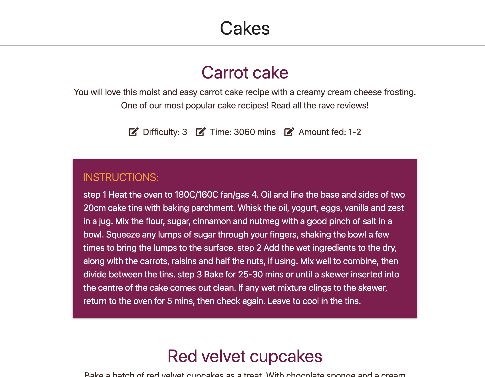

# Recipe Revolution

## A responsive recipe website hub for foodies.
***
## Code Institute – HTML, CSS, JavaScript, python+Flask and PostgreSQL -  Milestone Project 3.
***
## [Click Here To View The Live Project]()
***
## 
***
## Purpose

The purpose of 'Recipe Revolution' is to bring together a community of people who love finding and following new recipes while also creating their own. For those who don't feel confident making recipes but still love cooking will have access to all categories and recipes created by other users. And of course for those who want to share their knowledge are able to provide all the important details to their favorite recipes and share them!
***
## UX user experience
***
## User stories
- ### First time user goals
    1. As a First time user, I want to easily navigate to register and then log in when first entering the website application.
    2. As a First Time User, I want to navigate the website easily and interact with the content.
    3. As a first time user I want to easily add and view my recipes.
    4. As a first time user I want to easily navigate through any category to view their connected recipes.


- ### Returning user goals
    1. As a Returning User, I want to edit and delete my recipes.
    2. As a Returning User, I want to edit and delete my categories.
    3. As a Returning User, I want to see any new recipes/categories.

- ### Frequent user goals
    1. As a Frequent user, I want to be able to see any new categories or recipes created by other users.
    2. As a Frequent user, I want to easily edit and delete my recipes.
    3. As a Frequent user, I want to easily edit or delete any categories.


# Design

## Design Introduction

This website application is designed for users who are interested in joining the cooking community. Users will be able to see all categories and recipes created by other users. The users will be able to add, edit and delete their own recipes.


## Colour Scheme

- The main colors of the website are:


## Wireframes

### Home page


### Categories


### Recipes


### Sign in


### Register


# Data Structure

- [PostgreSQL](https://www.postgresql.org/) is used for the backend functionality of the application, that allows admin to create categories and users to register and log in.

## Data Model


- Users -

- Categories -

- Recipes -

# Features

## Features on all pages

### Nav 


- The nav bar presents different options whether the user is logged in or logged out
- The logo links back to the landing page
- The nav bar becomes a slide-out menu on smaller screen sizes

### Flash messages 


- Flash messages are used to confirm actions. For example, they will be alerted when they have been registered, logged in etc.

## Home features 


- The purpose of this website landing page is to demonstrate the purpose of the website. The 'your recipes' section accompanied with the 'Revolutionise your recipes' section demonstrate the purpose of the website


### Recipes 



- Another purpose of the landing page is to inspire users to start creating recipes using others as a basis for their ideas. All categories are displayed in the 'your recipes' section and any can be clicked to reveal all subsequent recipes attached to that category, including their own and those submitted by other users.

## Register/Log In 


- The Register and Log in pages both feature forms, a submit button and a link to either sign in if you're already registered, or register if you don't have a username already.

- The register form features input fields for Name, Username and Password. The Users password is hashed. Usernames are unique so they will be alerted/stopped if they're trying to use a name already taken.

- The Log in form features input fields for Username and Password. The Users password is hashed. Incorrect Username and/or Password will be met with an alert informing the user. 

## Recipes page


- The recipes page features all recipes created by the user 

- The user can either delete or edit their recipes. Deleting the post elicits a modal allowing the user to double check their decision

## Categories page 


- The categories page features all recipes created by the user 

- The user can either delete or edit their category. Deleting the post elicits a modal allowing the user to double check their decision

# Technologies Used
## Languages Used
-   [HTML5](https://en.wikipedia.org/wiki/HTML5)
-   [CSS3](https://en.wikipedia.org/wiki/Cascading_Style_Sheets)
-   [JavaScript](https://en.wikipedia.org/wiki/JavaScript)
-   [Python](https://www.python.org/)

## Frameworks libraries and programming interface
1. [Google Fonts:](https://fonts.google.com/)
    - Google fonts is used to import the Google font ...
1. [Font Awesome:](https://fontawesome.com/)
    - Font Awesome was used on all pages throughout the website to add icons for aesthetic and UX purposes.
1. [Git](https://git-scm.com/)
    - Git was used for version control by utilizing the Gitpod terminal to commit to Git and Push to GitHub.
1. [GitHub:](https://github.com/)
    - GitHub is used to store the projects code after being pushed from Git.
1. [Balsamiq:](https://balsamiq.com/)
    - Balsamiq was used to create the wireframes.
1. [Am I Responsive Design:](http://ami.responsivedesign.is/)
    - Am I Responsive Design was used for the responsive image in Readme.
1. [Flask](https://flask.palletsprojects.com/en/2.2.x/)
    - To construct and render page templates, and create an instance of the app itself.
1. [WerKzeug](https://werkzeug.palletsprojects.com/en/2.2.x/)
    - A WSGI web application library used for hashing user passwords for Python.
1. [jinja](https://jinja.palletsprojects.com/en/3.1.x/)
    - Templating language for Python, to simplify displaying data from the backend of this project smoothly and effectively in HTML.
1. [SQLAlchemy](https://www.sqlalchemy.org/)
    - Used to filter and search through the database.
1. [Heroku](https://id.heroku.com/login)
    - A cloud based platform for that is used for hosting this python web based application. 

***
# Testing

### Testing is in TESTING.md - [Link to TESTING.md](/TESTING.md)

## Deployment

### Heroku

This project is deployed using Heroku. To deploy to Heroku, follow these steps:

1. In GitPod CLI in the root directoy of the project, run: `pip3 free --local > requirements.txt` to create a `requirements.txt` file.
2. In the Gitpod project's root directory, create a new file called Procfile. Open the Procfile, and inside this, check that `web: python3 run.py` has been added or whatever the name of your application happens to be. Remove the blank line at the bottom of the file if that has been created.
3. Login to Heroku, select 'Create new app', add the desired name for your app and choose your closest region, note all names must be unique.
4. Navigate to the Deploy tab on Heroku dashboard and select Github. Search for your repository and when found, click 'connect'.
5. Navigate to the settings tab, click 'reveal config vars' and input the the following:

Key | Value
----|------
DATABASE_URL | ** see below
IP | 0.0.0.0
PORT | 5000
SECTRET_KEY | a_secret_key

** either use your pre configured database url, or provision a postgreSQL database in heroku from the project menu this value will then be pre-populated

6. Return to the Deploy tab and select 'enable automatic deploys'
7. Click 'deploy branch'
8. Click 'Open app' after the build is completed


### github

### Forking the GitHub Repository

By forking the GitHub Repository we make a copy of the original repository on our GitHub account to view and/or make changes without affecting the original repository by using the following steps...

1. Log in to GitHub and locate the [GitHub Repository](https://github.com/CassJBeckford/RecipeRevolution-mp3)
2. At the top of the Repository (not top of page) just above the "Settings" Button on the menu, locate the "Fork" Button.
3. You should now have a copy of the original repository in your GitHub account.

### Making a Local Clone

1. Log in to GitHub and locate the [GitHub Repository](https://github.com/CassJBeckford/RecipeRevolution-mp3)
2. Under the repository name, click "Clone or download".
3. To clone the repository using HTTPS, under "Clone with HTTPS", copy the link.
4. Open Git Bash
5. Change the current working directory to the location where you want the cloned directory to be made.
6. Type `git clone`, and then paste the URL you copied in Step 3.

```
$ git clone https://github.com/YOUR-USERNAME/YOUR-REPOSITORY
```

7. Press Enter. Your local clone will be created.

```
$ git clone https://github.com/YOUR-USERNAME/YOUR-REPOSITORY
> Cloning into `CI-Clone`...
> remote: Counting objects: 10, done.
> remote: Compressing objects: 100% (8/8), done.
> remove: Total 10 (delta 1), reused 10 (delta 1)
> Unpacking objects: 100% (10/10), done.
```
***


## Credits
***

###  Code

   -   [Code Institute](https://codeinstitute.net/): Code Institutes lessons have help with all coding throughout this project.

   -   [Code Institute Sample README.md](https://github.com/Code-Institute-Solutions/SampleREADME): Code Institute Sample README.md has been used to help with readme layout.


### Content

### Acknowledgments
