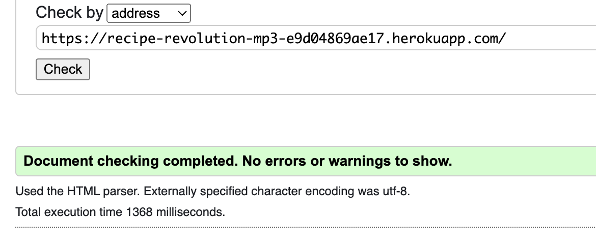
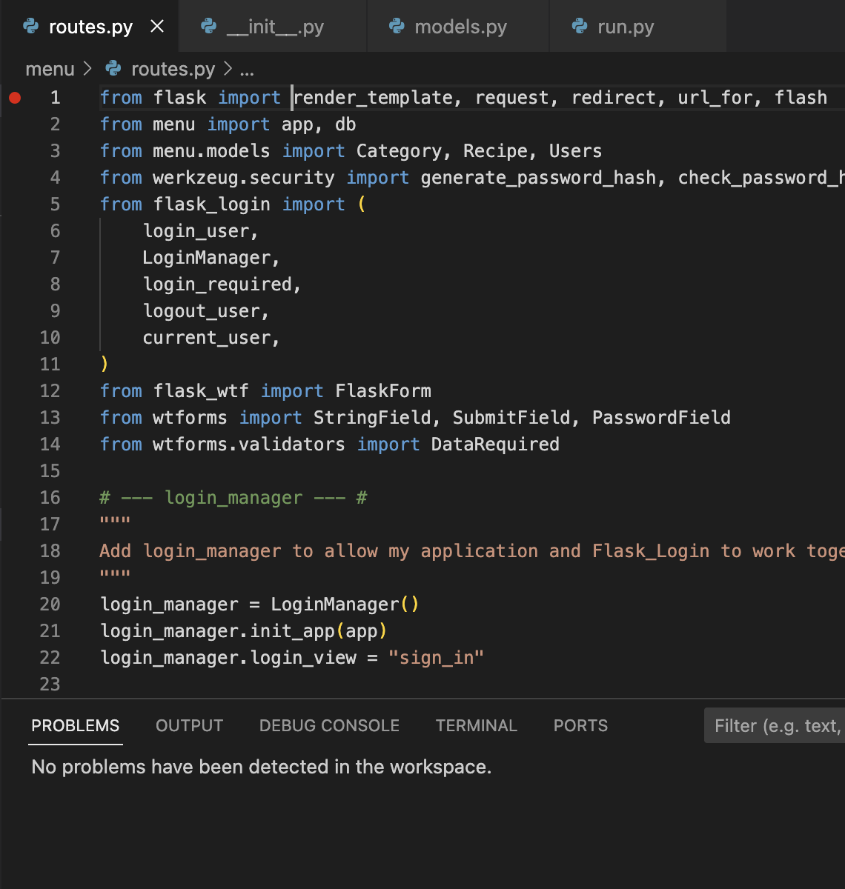
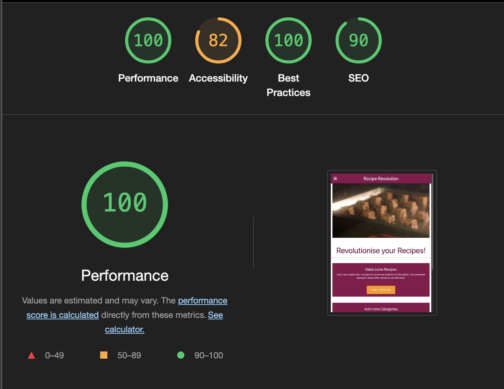
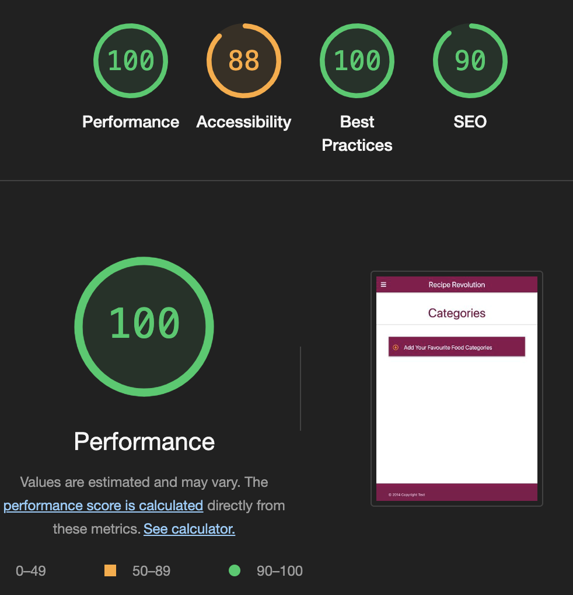
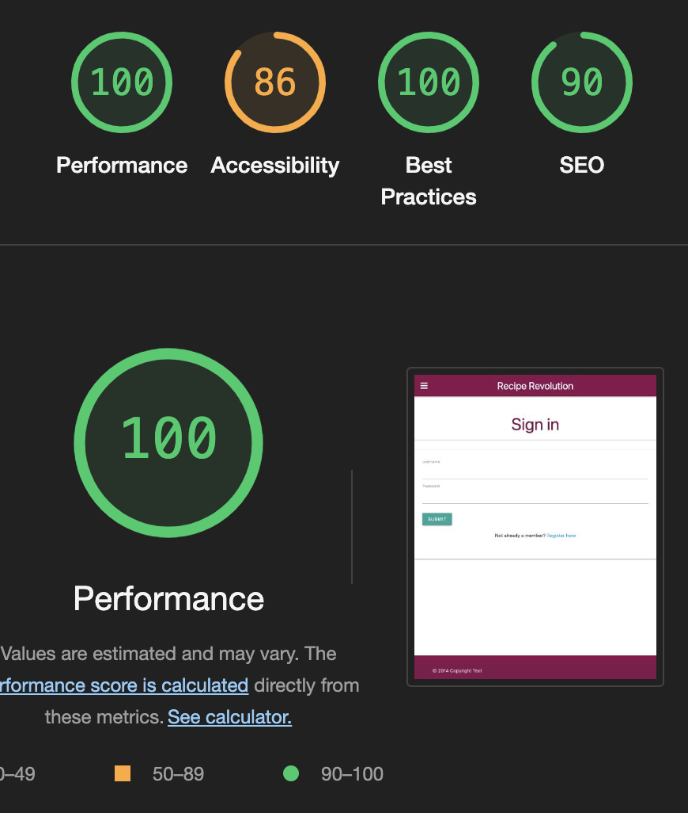

# Testing

## Code validation 

### W3C HTML Validator 

The W3C Markup Validator and W3C CSS Validator Services were used to validate the project to ensure there were no syntax errors in the project.

### W3C CSS Validator 

### Python validation using VSCode

- PEP8 Results

### Lighthouse 

- Home page

- Recipes/Categories page

- Sign up/Register 

## Manual Testing 

| **Page**        | **Testing**                                                      | **Outcome** |
| --------------- | :--------------------------------------------------------------: | ---:|
|NAV              | Title of webpage leads back to home page                         | YES|
|NAV              | Recipes button takes user to recipes page                        | YES|
|NAV              | Categories button takes user to categories page                  | YES|
|NAV              | Log in button takes you to register page                         | YES|
|HOME PAGE        | 'START CREATING' buttons take user to recipes or categories page | YES|
|HOME PAGE        | 'RECIPES' button shows all recipes in category                   | YES|
|RECIPES          | '+' button allows user to create recipes                         | YES|
|RECIPES          | 'EDIT' button allows user to edit recipe                         | YES|
|RECIPES          | 'DELETE' button allows user to delete recipe + creates modal     | YES|
|CATEGORIES       | '+' button allows user to create categories                      | YES|
|CATEGORIES       | 'EDIT' button allows user to edit category title                 | YES|
|CATEGORIES       | 'DELETE' button allows user to delete category + creates modal   | YES|
|LOG IN           |  Sign in button checks in the user exists and log them in        | YES|
|LOG IN           |  Register button takes user to register page                     | YES|
|REGISTER         |  Register button checks if user exists and creates new user      | YES|
|REGISTER         |  Sign in button takes user to sign in page                       | YES|

## Further Testing

This website was tested on:

- Google Chrome, Firefox, Microsoft Edge and Safari.
- Testing has been done to ensure all elements were linking correctly.

## Bugs

There are no known bugs 